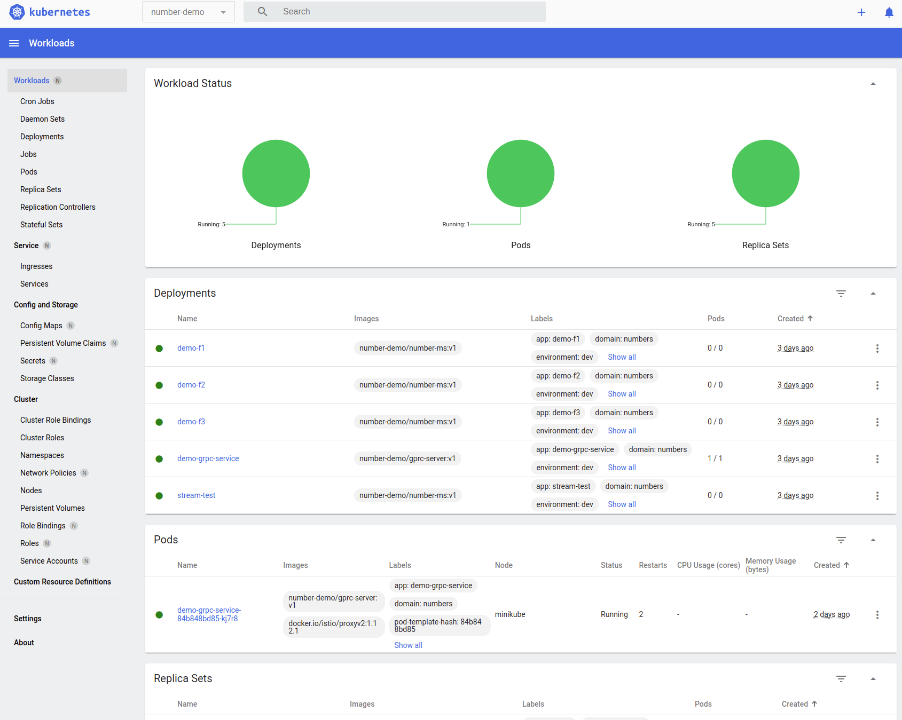
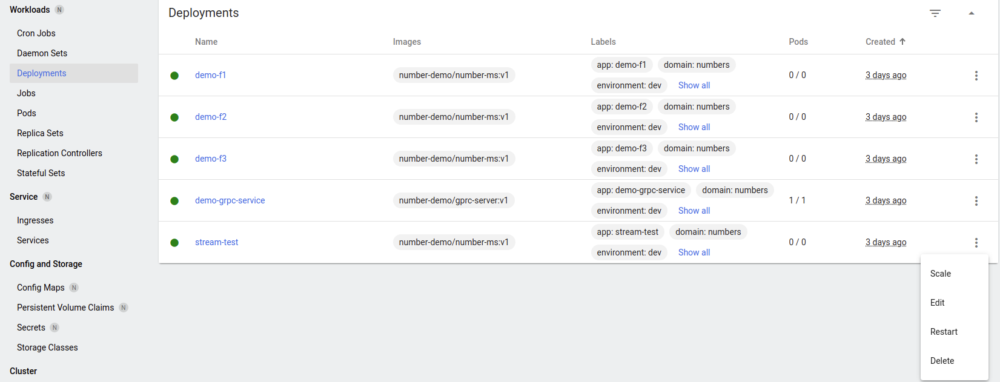
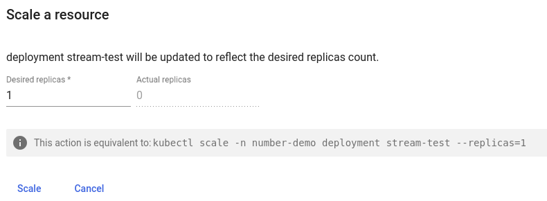
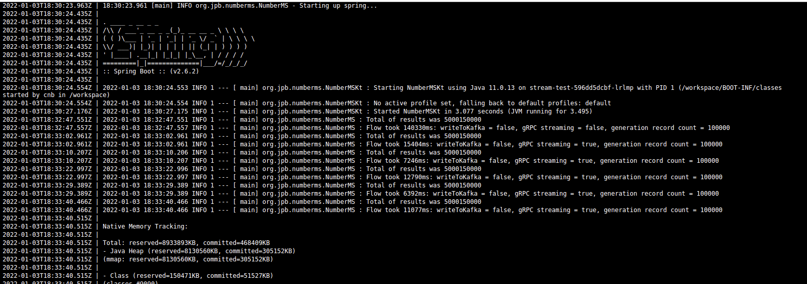

# Getting started

## Installing Istio

On a a clean Ubuntu 20.04 installed Docker & [minikube](https://minikube.sigs.k8s.io/docs/) (Kubernetes on a single machine)

``` bash
sudo apt-get update
sudo apt-get install     ca-certificates     curl     gnupg     lsb-release
curl -fsSL https://download.docker.com/linux/ubuntu/gpg | sudo gpg --dearmor -o /usr/share/keyrings/docker-archive-keyring.gpg
echo   "deb [arch=$(dpkg --print-architecture) signed-by=/usr/share/keyrings/docker-archive-keyring.gpg] https://download.docker.com/linux/ubuntu \
$(lsb_release -cs) stable" | sudo tee /etc/apt/sources.list.d/docker.list > /dev/null
sudo apt-get update
sudo apt-get install docker-ce docker-ce-cli containerd.io
sudo docker run hello-world
mkdir installs
cd installs/
curl -LO https://storage.googleapis.com/minikube/releases/latest/minikube-linux-amd64
sudo install minikube-linux-amd64 /usr/local/bin/minikube
minikube start
sudo groupadd docker
sudo usermod -aG docker $USER
docker run hello-world
```
## Start Istio

``` bash
$ minikube start --memory=8192 --cpus=4

* minikube v1.24.0 on Ubuntu 20.04
* Using the docker driver based on existing profile
! Your cgroup does not allow setting memory.
  - More information: https://docs.docker.com/engine/install/linux-postinstall/#your-kernel-does-not-support-cgroup-swap-limit-capabilities
! Your cgroup does not allow setting memory.
  - More information: https://docs.docker.com/engine/install/linux-postinstall/#your-kernel-does-not-support-cgroup-swap-limit-capabilities
! You cannot change the memory size for an existing minikube cluster. Please first delete the cluster.
* Starting control plane node minikube in cluster minikube
* Pulling base image ...
* Restarting existing docker container for "minikube" ...
* Preparing Kubernetes v1.22.3 on Docker 20.10.8 ...
* Verifying Kubernetes components...
  - Using image kubernetesui/dashboard:v2.3.1
  - Using image kubernetesui/metrics-scraper:v1.0.7
  - Using image gcr.io/k8s-minikube/storage-provisioner:v5
* Enabled addons: storage-provisioner, default-storageclass, dashboard
* Done! kubectl is now configured to use "minikube" cluster and "default" namespace by default 
```

## Install samples and Kiali dashboard

See [script here](scripts/istio/install_dash.sh)

## Install Kafka

From [script](scripts/k8s/kafka.sh)

``` bash
kubectl create namespace kafka
kubectl create -f kafka_deploy.yaml -n kafka
kubectl apply -f kafka-ephemeral-single.yaml -n kafka 
```

### Check install progress and confirm running

``` bash
$ watch kubectl get all -n kafka 

NAME                                              READY   STATUS    RESTARTS         AGE
pod/my-cluster-entity-operator-6f66cdfdc8-v8lng   3/3     Running   19 (2m21s ago)   3d17h
pod/my-cluster-kafka-0                            1/1     Running   10 (3m41s ago)   3d17h
pod/my-cluster-zookeeper-0                        1/1     Running   12 (5m38s ago)   3d17h
pod/my-cluster-zookeeper-1                        1/1     Running   11 (5m54s ago)   3d17h
pod/my-cluster-zookeeper-2                        1/1     Running   12 (5m15s ago)   3d17h
pod/strimzi-cluster-operator-7d96cbff57-kt6jg     1/1     Running   3 (7m44s ago)    3d17h

NAME                                       TYPE        CLUSTER-IP       EXTERNAL-IP   PORT(S)                      AGE
service/my-cluster-kafka-bootstrap         ClusterIP   10.99.72.37      <none>        9091/TCP                     3d17h
service/my-cluster-kafka-brokers           ClusterIP   None             <none>        9090/TCP,9091/TCP            3d17h
service/my-cluster-kafka-plain-0           NodePort    10.97.135.61     <none>        9092:32203/TCP               3d17h
service/my-cluster-kafka-plain-bootstrap   NodePort    10.104.158.84    <none>        9092:31586/TCP               3d17h
service/my-cluster-kafka-tls-0             NodePort    10.108.18.147    <none>        9093:30420/TCP               3d17h
service/my-cluster-kafka-tls-bootstrap     NodePort    10.100.14.253    <none>        9093:30770/TCP               3d17h
service/my-cluster-zookeeper-client        ClusterIP   10.106.182.231   <none>        2181/TCP                     3d17h
service/my-cluster-zookeeper-nodes         ClusterIP   None             <none>        2181/TCP,2888/TCP,3888/TCP   3d17h

NAME                                         READY   UP-TO-DATE   AVAILABLE   AGE
deployment.apps/my-cluster-entity-operator   1/1     1            1           3d17h
deployment.apps/strimzi-cluster-operator     1/1     1            1           3d17h

NAME                                                    DESIRED   CURRENT   READY   AGE
replicaset.apps/my-cluster-entity-operator-6f66cdfdc8   1         1         1       3d17h
replicaset.apps/strimzi-cluster-operator-7d96cbff57     1         1         1       3d17h

NAME                                    READY   AGE
statefulset.apps/my-cluster-kafka       1/1     3d17h
statefulset.apps/my-cluster-zookeeper   3/3     3d17h ```
```

### Remove Kafka

If you need to re-install you can drop all the Kafka stuff in one call as it is installed under the _Kafka_ namespace:

``` bash
kubectl delete all --all -n kafka
```

# Running Istio/Kubernetes

## Start Kubernetes dashboard

``` bash
~/git/grpc-services/scripts/istio$ minikube dashboard
* Verifying dashboard health ...
* Launching proxy ...
* Verifying proxy health ...
* Opening http://127.0.0.1:39113/api/v1/namespaces/kubernetes-dashboard/services/http:kubernetes-dashboard:/proxy/ in your default browser...

```

# Install and run our services

## Install (inc build)

Run [script](scripts/k8s/deploy.sh) :

``` bash
eval $(minikube -p minikube docker-env)
d=`pwd`
cd ../..
./gradlew bootBuildImage
cd $d
kubectl create namespace number-demo
kubectl config set-context --current --namespace=number-demo
kubectl label namespace number-demo istio-injection=enabled --overwrite
echo "set namespace to .."
kubectl config view --minify | grep namespace:
kubectl apply -f deployment.yaml 
```

## Check install progress

Our apps/services are being created under _number-demo_ namespace.

``` bash
$ kubectl get all -n number-demo

NAME                                     READY   STATUS    RESTARTS        AGE
pod/demo-grpc-service-84b848bd85-kj7r8   2/2     Running   2 (2d21h ago)   2d22h

NAME                             TYPE        CLUSTER-IP       EXTERNAL-IP   PORT(S)     AGE
service/demo-grpc-service-grpc   ClusterIP   10.105.29.116    <none>        50051/TCP   3d
service/demo-grpc-service-rest   ClusterIP   10.105.150.138   <none>        8080/TCP    3d

NAME                                READY   UP-TO-DATE   AVAILABLE   AGE
deployment.apps/demo-f1             0/0     0            0           3d
deployment.apps/demo-f2             0/0     0            0           3d
deployment.apps/demo-f3             0/0     0            0           3d
deployment.apps/demo-grpc-service   1/1     1            1           3d
deployment.apps/stream-test         0/0     0            0           3d

NAME                                           DESIRED   CURRENT   READY   AGE
replicaset.apps/demo-f1-6cbf5bfc5d             0         0         0       3d
replicaset.apps/demo-f2-5bc8dc5c57             0         0         0       3d
replicaset.apps/demo-f3-744df8fb74             0         0         0       3d
replicaset.apps/demo-grpc-service-84b848bd85   1         1         1       3d
replicaset.apps/stream-test-596dd5dcbf         0         0         0       3d

```

## Remove services (so can re-install)

Run [script](scripts/k8s/remove.sh) :

``` bash
kubectl delete all --all -n number-demo
```

## Run services

The gRPC service _demo-grpc-service_ will be started during install as 1 replica is defined [in the deployment script](https://github.com/johnbarry/grpc-services/blob/44aa59c380de5480aa4834b3801f86c4a790fd96/scripts/k8s/deployment.yaml#L11).

### gRPC stream demo

This checks the speed of gRPC unary vs streaming APIs and does not use Kafka.  

#### Start from Kubernetes console

Use `minikube dashboard` to start the dashboard.  Choose the _number-demo_ namespace in top left handside of dashboard:



Scale up_ stream test_ by choosing Deployments on LHS menu and scaling to 1.





#### Start Istio dashboard

``` bash
istioctl dashboard kiali 
```

Choose Workloads then filter on _number-demo_ namespace. Click _demo-grpc-service_.

Should show metrics for gRPC calls: `http://localhost:20001/kiali/console/namespaces/number-demo/workloads/demo-grpc-service?duration=60&refresh=15000`


#### Check results

Choose Pods on LHS menu and click the menu icon on RHS of the stream-test line and choose _Logs_


